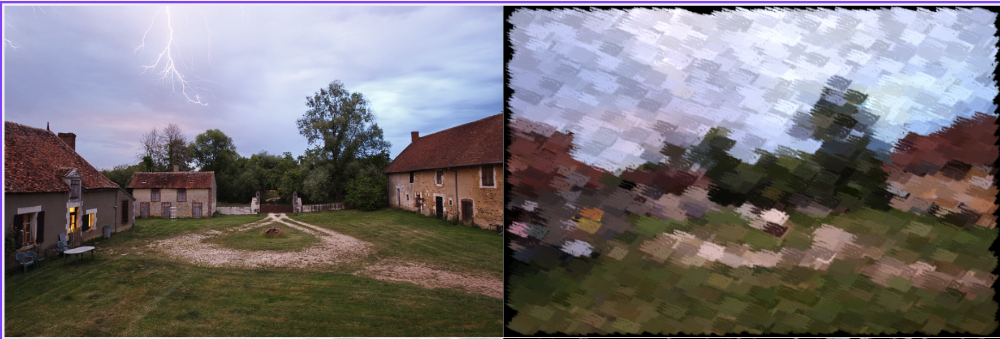

# Painterly Processing



## Overview
This project implements a collection of non-photorealistic "painterly" rendering techniques that transform photographs into images composed of stylized brush strokes. The C++ pipeline builds on image manipulation utilities and combines randomized stroke placement, importance sampling, structure-tensor orientation analysis, and experimental stroke rendering to create painterly effects.

## Features
* **Texture-based brush stamping** – `brush` splats an input texture at a chosen pixel, blending it with the underlying image to simulate a single stroke.
* **Randomized single-scale painting** – `singleScalePaint` resizes the texture and scatters `N` noisy strokes across the canvas to re-create the source image in a single layer.
* **Importance-driven multi-pass rendering** – `singleScalePaintImportance`, `sharpnessMap`, and `painterly` build sharpness maps and reuse them across coarse and fine passes to concentrate detail where the image contains high-frequency content.
* **Orientation-aware strokes** – `computeTensor`, `testAngle`, and `singleScaleOrientedPaint` analyze local structure tensors to rotate brushes so that strokes follow image features; `orientedPaint` runs a two-pass version of this pipeline.
* **Stroke rendering experiment** – `paintTransformer` renders simple geometric strokes with parameters sampled from the target image, producing a coarse painterly approximation.

## Repository layout
* `Input/` – source photographs and brush textures used by the demos in `a8_main.cpp`.
* `Output/` – destination directory for generated artwork; functions write intermediate and final images here (e.g., `painterly_output_final.png`).
* `Eigen/` – bundled Eigen linear algebra headers required for structure tensor eigen-analysis.
* Core source files implement the image abstraction (`Image.*`), basic filtering (`basicImageManipulation.*`, `filtering.*`), and non-photorealistic rendering utilities (`npr.*`).

## Building
The project uses a Makefile-based build that targets the `a8` executable by default. Ensure you have a C++11-capable compiler (e.g., `g++`) installed, then run:

```bash
make
```

The build scripts compile sources into `_build/` and place intermediates automatically. Use `make clean` to remove artifacts.

## Running demos
By default, `main` invokes `testPaintTransformer()`; uncomment other helpers in `a8_main.cpp` to experiment with different pipelines. After building, execute:

```bash
./a8
```

Generated images will be saved in the `Output/` directory with descriptive filenames (for example, `oriented_paint_final.png` or `paint_transformer.png`).

## Performance notes
* Orientation-aware rendering performs per-pixel eigen decomposition of the structure tensor, which can be slow for large images or high stroke counts.
* Processing time scales with both image resolution and the number of strokes (`N` parameter).

## Customization tips
* Swap any of the input photos or brush textures by editing the paths passed to the helper functions in `a8_main.cpp`. All helpers load images from `Input/`, so you can add your own resources there.
* Adjust stroke density, size, noise, or angle counts via the parameters of the helper routines to explore different painterly aesthetics.
* For orientation-aware results, tune the structure tensor parameters `sigmaG` and `factorSigma` when calling `computeTensor` to match the scale of features in your input imagery.

Happy painting!
